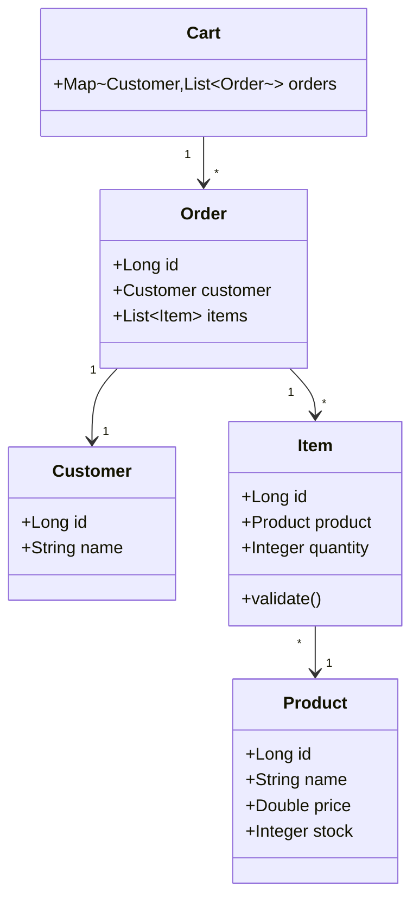

# 🛒 Order Management System

> Order management system with inventory control, sales analytics, and customer metrics built with clean architecture and SOLID principles. **Currently in Java Core, migrating to Spring Boot.**

[](https://www.oracle.com/java/)
[]()
[](LICENSE)
[](README.md)
[](README.en.md)

---

## 📋 About The Project

Order management system that provides control over the sales cycle, from inventory validation to business performance analytics. Developed with focus on scalability, maintainability, and software engineering best practices.

### Problem Solved
Companies need to manage orders efficiently, controlling inventory in real-time, identifying high-value customers, and best-selling products for strategic decision-making.

### Current Solution
Java Core system with business validations, inventory control, real-time analytics, and layered architecture prepared for evolution to REST API with Spring Boot.

---

## ✨ Features

### Core Business
- ✅ **Order Management** - Creation and processing with integrity validation
- ✅ **Inventory Control** - Validation and automatic discount in real-time
- ✅ **Multi-Client Cart** - Isolated management per customer
- ✅ **Business Validations** - Fail-fast pattern with custom exceptions

### Analytics & Insights
- 📊 **Total per Customer** - Aggregated calculation of individual spending
- 🏆 **Top Customers** - Ranking of top 3 buyers
- 📈 **Best-Seller Product** - Identification of most sold item
- 💰 **Average Ticket** - Average order value analysis
- 🎯 **Premium Customer** - Identification of highest spender

### Advanced Operations
- 🔍 **Price Filtering** - Search items by maximum value
- 📉 **Value Sorting** - Items sorted by descending price
- ⚡ **Functional Processing** - Streams API for high performance

---

## 🏗️ Architecture

### Current Structure (Java Core)
```
src/
├── domain/              # Business entities with validations
│   ├── Customer.java
│   ├── Product.java
│   ├── Item.java
│   ├── Order.java
│   └── Cart.java
├── services/            # Business logic and rules
│   ├── OrderServices.java
│   └── CartServices.java
├── exception/           # Custom domain exceptions
│   └── [8 specific exceptions]
└── Main.java
```

### Future Structure (Spring Boot)
```
src/main/java/com.sistema.pedidos/
├── controller/          # REST API endpoints
├── service/             # Business logic layer
├── repository/          # Data access layer (JPA)
├── entity/              # JPA entities
├── dto/                 # Data transfer objects
├── exception/           # Exception handling
└── config/              # Spring configurations
```

### Applied Principles
- **Clean Architecture** - Clear separation of concerns
- **SOLID** - Single Responsibility, Open/Closed, Dependency Inversion
- **DRY** - Reusability through Streams API
- **Fail-Fast** - Validations in constructors

---

## 🎯 Domain Model



### Entities

| Entity | Responsibility | Validations |
|--------|----------------|-------------|
| **Customer** | Customer identification | Unique ID, required name |
| **Product** | Product catalog | Price > 0, stock >= 0 |
| **Item** | Order line | Quantity > 0, sufficient stock |
| **Order** | Item aggregation | Minimum 1 item, required customer |
| **Cart** | Shopping context | Unique orders per customer |

### Services

| Service | Operations | Complexity |
|---------|-----------|------------|
| **OrderServices** | Calculation, filtering, sorting | O(n) |
| **CartServices** | Analytics, rankings, aggregations | O(n log n) |

---

## ⚙️ Business Rules

### Inventory Management
- ❌ **Insufficient stock blocks sale** - Validation in Item constructor
- ⚡ **Automatic discount** - Stock updated when adding to cart
- 🔒 **Sequential control** - Discount applied item by item (future: @Transactional)

### Data Integrity
- 🆔 **Unique customer** - Identification by ID with equals/hashCode
- 🚫 **Unique orders** - Same ID cannot be duplicated per customer
- ✅ **Fail-fast validation** - Errors detected in constructors
- 📝 **Non-empty orders** - Minimum 1 item required

### Analytics Operations
- 📊 **Empty cart** - Analysis operations throw EmptyCartException
- 🎯 **Real-time calculations** - No cache, always updated data
- 🔢 **Decimal precision** - Double for monetary values (migrate to BigDecimal)

### Architecture
- 🏛️ **Layer separation** - Domain (data) + Services (logic)
- 🎯 **Single Responsibility** - Each class with unique purpose
- 🔌 **Low coupling** - Services don't depend on each other

---

## 🚨 Exception Handling

### Business Exceptions

| Exception | Scenario | HTTP Status (future) |
|-----------|----------|---------------------|
| `StockProductException` | Insufficient stock for requested quantity | 409 Conflict |
| `DuplicateOrderException` | Duplicate order for same customer | 409 Conflict |
| `EmptyCartException` | Operation on empty cart | 400 Bad Request |
| `EmptyOrderException` | Order without items | 400 Bad Request |

### Validation Exceptions

| Exception | Scenario | HTTP Status (future) |
|-----------|----------|---------------------|
| `InvalidQuantityException` | Quantity <= 0 | 400 Bad Request |
| `InvalidPriceException` | Price <= 0 | 400 Bad Request |
| `NullCustomerException` | Customer not provided | 400 Bad Request |
| `NullProductException` | Product not provided | 400 Bad Request |

### Strategy
- ✅ **Fail-Fast** - Validations in constructors
- 📝 **Descriptive messages** - Clear error context
- 🎯 **Specific** - One exception per error type
- 🔮 **REST-ready** - Future mapping to HTTP status

---

## 🚀 Getting Started

### Prerequisites
- Java 8 or higher
- Maven 3.8+ (future)
- Git

### Installation

```bash
# Clone the repository
git clone https://github.com/<your-username>/order-management-system.git
cd order-management-system

# Compile (current version - Windows)
javac -d bin -cp src src/Main.java src/domain/*.java src/services/*.java src/exception/*.java

# Run
java -cp bin Main

# Or compile everything at once (Unix/Linux/Mac)
find src -name "*.java" | xargs javac -d bin
java -cp bin Main
```

### Future Execution (Spring Boot)

```bash
# With Maven
mvn spring-boot:run

# With Docker
docker-compose up

# Access the API
http://localhost:8080/api/v1

# Swagger Documentation
http://localhost:8080/swagger-ui.html
```

---

## 🛠️ Tech Stack

### Current (v1.0 - Java Core)
- **Java 8+** - OOP with Streams API
- **Streams API** - Functional processing and data pipelines
- **Collections Framework** - Map, List, Optional for complex structures
- **Clean Architecture** - Domain/Services separation
- **Exception Handling** - 8 custom exceptions with fail-fast

### Roadmap (v2.0 - Spring Ecosystem)
- **Spring Boot 3.x** - Enterprise framework
- **Spring Data JPA** - Persistence with Hibernate
- **Spring Security** - JWT authentication
- **PostgreSQL** - Relational database
- **Docker** - Containerization
- **JUnit 5 + Mockito** - Automated testing
- **Swagger/OpenAPI** - API documentation
- **GitHub Actions** - CI/CD pipeline

---

## 🗺️ Roadmap

### ✅ v1.0 - Foundation (Completed)
- [x] Layered architecture with SOLID
- [x] 8 custom exceptions with fail-fast
- [x] Streams API for functional operations
- [x] Complete analytics (rankings, averages, totals)
- [x] Transactional inventory control

### 🚧 v2.0 - Spring Migration (In Progress)
- [ ] **Sprint 1** - Spring Boot Setup + REST API
- [ ] **Sprint 2** - PostgreSQL + JPA Repositories
- [ ] **Sprint 3** - Spring Security + JWT
- [ ] **Sprint 4** - Tests (Unit + Integration)
- [ ] **Sprint 5** - Docker + CI/CD

### 🔮 v3.0 - Advanced Features (Planned)
- [ ] Redis for analytics caching
- [ ] RabbitMQ for asynchronous processing
- [ ] Elasticsearch for advanced search
- [ ] Grafana + Prometheus for monitoring
- [ ] API Gateway with rate limiting

### 📊 Quality Metrics (v2.0 Goals)
- [ ] Code Coverage > 80%
- [ ] SonarQube Quality Gate A
- [ ] API Response Time < 200ms
- [ ] Zero critical vulnerabilities
- [ ] Complete OpenAPI documentation

---

## 🤝 Contributing

Contributions are welcome! To contribute:

1. Fork the project
2. Create your feature branch (`git checkout -b feature/AmazingFeature`)
3. Commit your changes (`git commit -m 'Add some AmazingFeature'`)
4. Push to the branch (`git push origin feature/AmazingFeature`)
5. Open a Pull Request

---

## 📄 License

This project is licensed under the MIT License. See the [LICENSE](LICENSE) file for details.

---

## 👤 Author

**Your Name**
- GitHub: [@your-username](https://github.com/your-username)
- LinkedIn: [Your Name](https://linkedin.com/in/your-profile)
- Email: your.email@example.com

---

## 🙏 Acknowledgments

- Inspired by real e-commerce systems
- Developed with focus on best practices and clean code
- Prepared for enterprise evolution with Spring Framework

---

<div align="center">

**⭐ If this project was useful, consider giving it a star!**

Made with ☕ and Java

</div>
