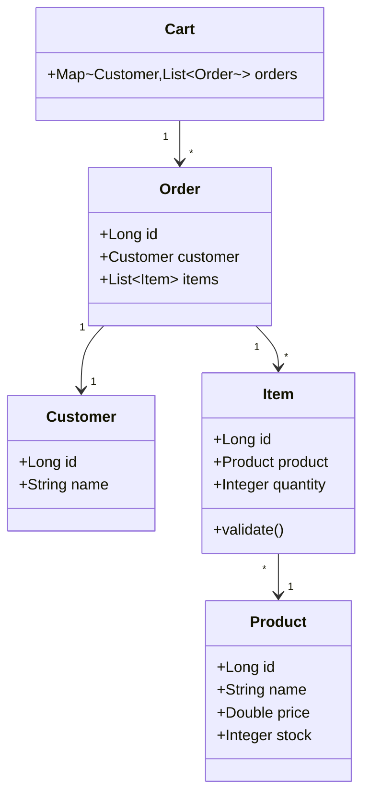

# 🛒 Order Management System

> Sistema de gerenciamento de pedidos com controle de estoque, análise de vendas e métricas de clientes desenvolvido com arquitetura limpa e princípios SOLID. **Atualmente em Java Core, migrando para Spring Boot.**

[](https://www.oracle.com/java/)
[]()
[](LICENSE)
[](README.md)
[](README.en.md)

---

## 📋 Sobre o Projeto

Sistema de gerenciamento de pedidos que oferece controle sobre o ciclo de vendas, desde a validação de estoque até análises de performance comercial. Desenvolvido com foco em escalabilidade, manutenibilidade e boas práticas de engenharia de software.

### Problema Resolvido
Empresas precisam gerenciar pedidos de forma eficiente, controlando estoque em tempo real, identificando clientes de alto valor e produtos mais vendidos para tomada de decisão estratégica.

### Solução Atual
Sistema Java Core com validações de negócio, controle de estoque, analytics em tempo real e arquitetura em camadas preparada para evolução para API REST com Spring Boot.

---

## ✨ Funcionalidades

### Core Business
- ✅ **Gestão de Pedidos** - Criação e processamento com validação de integridade
- ✅ **Controle de Estoque** - Validação e desconto automático em tempo real
- ✅ **Carrinho Multi-Cliente** - Gerenciamento isolado por cliente
- ✅ **Validações de Negócio** - Fail-fast pattern com exceções customizadas

### Analytics & Insights
- 📊 **Total por Cliente** - Cálculo agregado de gastos individuais
- 🏆 **Top Clientes** - Ranking dos 3 maiores compradores
- 📈 **Produto Best-Seller** - Identificação do item mais vendido
- 💰 **Ticket Médio** - Análise de valor médio dos pedidos
- 🎯 **Cliente Premium** - Identificação do maior gastador

### Operações Avançadas
- 🔍 **Filtragem Inteligente** - Busca de itens por faixa de preço
- 📉 **Ordenação Customizada** - Múltiplos critérios de ordenação
- ⚡ **Processamento Funcional** - Streams API para alta performance

---

## 🏗️ Arquitetura

### Estrutura Atual (Java Core)
```
src/
├── domain/              # Entidades de negócio com validações
│   ├── Customer.java
│   ├── Product.java
│   ├── Item.java
│   ├── Order.java
│   └── Cart.java
├── services/            # Lógica de negócio e regras
│   ├── OrderServices.java
│   └── CartServices.java
├── exception/           # Exceções de domínio customizadas
│   └── [8 exceções específicas]
└── Main.java
```

### Estrutura Futura (Spring Boot)
```
src/main/java/com.sistema.pedidos/
├── controller/          # REST API endpoints
├── service/             # Business logic layer
├── repository/          # Data access layer (JPA)
├── entity/              # JPA entities
├── dto/                 # Data transfer objects
├── exception/           # Exception handling
└── config/              # Spring configurations
```

### Princípios Aplicados
- **Clean Architecture** - Separação clara de responsabilidades
- **SOLID** - Single Responsibility, Open/Closed, Dependency Inversion
- **DRY** - Reutilização através de Streams API
- **Fail-Fast** - Validações nos construtores
- **Immutability** - Uso de Optional e Collections imutáveis onde aplicável

---

## 🎯 Modelo de Domínio



### Entidades

| Entidade | Responsabilidade | Validações |
|----------|------------------|------------|
| **Customer** | Identificação do cliente | ID único, nome obrigatório |
| **Product** | Catálogo de produtos | Preço > 0, estoque >= 0 |
| **Item** | Linha do pedido | Quantidade > 0, estoque suficiente |
| **Order** | Agregação de itens | Mínimo 1 item, cliente obrigatório |
| **Cart** | Contexto de compras | Pedidos únicos por cliente |

### Serviços

| Serviço | Operações | Complexidade |
|---------|-----------|-------------|
| **OrderServices** | Cálculo, filtragem, ordenação | O(n) |
| **CartServices** | Analytics, rankings, agregações | O(n log n) |

---

## ⚙️ Regras de Negócio

### Gestão de Estoque
- ❌ **Estoque insuficiente bloqueia venda** - Validação no construtor de Item
- ⚡ **Desconto automático** - Estoque atualizado ao adicionar no carrinho
- 🔒 **Transacional** - Rollback em caso de falha (futuro com @Transactional)

### Integridade de Dados
- 🆔 **Cliente único** - Identificação por ID com equals/hashCode
- 🚫 **Pedidos únicos** - Mesmo ID não pode ser duplicado por cliente
- ✅ **Validação fail-fast** - Erros detectados nos construtores
- 📝 **Pedidos não-vazios** - Mínimo 1 item obrigatório

### Operações de Analytics
- 📊 **Carrinho vazio** - Operações de análise lançam EmptyCartException
- 🎯 **Cálculos em tempo real** - Sem cache, sempre dados atualizados
- 🔢 **Precisão decimal** - Double para valores monetários (migrar para BigDecimal)

### Arquitetura
- 🏛️ **Separação de camadas** - Domain (dados) + Services (lógica)
- 🎯 **Single Responsibility** - Cada classe com propósito único
- 🔌 **Baixo acoplamento** - Services não dependem entre si

---

## 🚨 Exception Handling

### Exceções de Negócio

| Exceção | Cenário | HTTP Status (futuro) |
|---------|---------|----------------------|
| `StockProductException` | Estoque insuficiente para quantidade solicitada | 409 Conflict |
| `DuplicateOrderException` | Pedido duplicado para mesmo cliente | 409 Conflict |
| `EmptyCartException` | Operação em carrinho vazio | 400 Bad Request |
| `EmptyOrderException` | Pedido sem itens | 400 Bad Request |

### Exceções de Validação

| Exceção | Cenário | HTTP Status (futuro) |
|---------|---------|----------------------|
| `InvalidQuantityException` | Quantidade <= 0 | 400 Bad Request |
| `InvalidPriceException` | Preço <= 0 | 400 Bad Request |
| `NullCustomerException` | Cliente não informado | 400 Bad Request |
| `NullProductException` | Produto não informado | 400 Bad Request |

### Estratégia
- ✅ **Fail-Fast** - Validações nos construtores
- 📝 **Mensagens descritivas** - Contexto claro do erro
- 🎯 **Específicas** - Uma exceção por tipo de erro
- 🔮 **Preparadas para REST** - Mapeamento futuro para HTTP status

---

## 🚀 Como Executar

### Pré-requisitos
- Java 17 ou superior
- Maven 3.8+ (futuro)
- Git

### Instalação

```bash
# Clone o repositório
git clone https://github.com/<seu-usuario>/order-management-system.git
cd order-management-system

# Compile (versão atual - Windows)
javac -d bin -cp src src/Main.java src/domain/*.java src/services/*.java src/exception/*.java

# Execute
java -cp bin Main

# Ou compile tudo de uma vez (Unix/Linux/Mac)
find src -name "*.java" | xargs javac -d bin
java -cp bin Main
```

### Execução Futura (Spring Boot)

```bash
# Com Maven
mvn spring-boot:run

# Com Docker
docker-compose up

# Acesse a API
http://localhost:8080/api/v1

# Documentação Swagger
http://localhost:8080/swagger-ui.html
```

---

## 🛠️ Stack Tecnológica

### Atual (v1.0 - Java Core)
- **Java 8+** - POO com Streams API
- **Streams API** - Processamento funcional e pipelines de dados
- **Collections Framework** - Map, List, Optional para estruturas complexas
- **Clean Architecture** - Separação Domain/Services
- **Exception Handling** - 8 exceções customizadas com fail-fast

### Roadmap (v2.0 - Spring Ecosystem)
- **Spring Boot 3.x** - Framework enterprise
- **Spring Data JPA** - Persistência com Hibernate
- **Spring Security** - Autenticação JWT
- **PostgreSQL** - Banco relacional
- **Docker** - Containerização
- **JUnit 5 + Mockito** - Testes automatizados
- **Swagger/OpenAPI** - Documentação de API
- **GitHub Actions** - CI/CD pipeline

---

## 🗺️ Roadmap

### ✅ v1.0 - Foundation (Concluído)
- [x] Arquitetura em camadas com SOLID
- [x] 8 exceções customizadas com fail-fast
- [x] Streams API para operações funcionais
- [x] Analytics completo (rankings, médias, totais)
- [x] Controle de estoque transacional

### 🚧 v2.0 - Spring Migration (Em Progresso)
- [ ] **Sprint 1** - Setup Spring Boot + REST API
- [ ] **Sprint 2** - PostgreSQL + JPA Repositories
- [ ] **Sprint 3** - Spring Security + JWT
- [ ] **Sprint 4** - Testes (Unit + Integration)
- [ ] **Sprint 5** - Docker + CI/CD

### 🔮 v3.0 - Advanced Features (Planejado)
- [ ] Redis para cache de analytics
- [ ] RabbitMQ para processamento assíncrono
- [ ] Elasticsearch para busca avançada
- [ ] Grafana + Prometheus para monitoring
- [ ] API Gateway com rate limiting

### 📊 Métricas de Qualidade (Metas v2.0)
- [ ] Code Coverage > 80%
- [ ] SonarQube Quality Gate A
- [ ] API Response Time < 200ms
- [ ] Zero vulnerabilidades críticas
- [ ] Documentação OpenAPI completa


---

## 🤝 Contribuindo

Contribuições são bem-vindas! Para contribuir:

1. Fork o projeto
2. Crie uma branch para sua feature (`git checkout -b feature/AmazingFeature`)
3. Commit suas mudanças (`git commit -m 'Add some AmazingFeature'`)
4. Push para a branch (`git push origin feature/AmazingFeature`)
5. Abra um Pull Request

---

## 📄 Licença

Este projeto está sob a licença MIT. Veja o arquivo [LICENSE](LICENSE) para mais detalhes.

---

## 👤 Autor

**Seu Nome**
- GitHub: [@seu-usuario](https://github.com/seu-usuario)
- LinkedIn: [Seu Nome](https://linkedin.com/in/seu-perfil)
- Email: seu.email@example.com

---

## 🙏 Agradecimentos

- Inspirado em sistemas reais de e-commerce
- Desenvolvido com foco em boas práticas e código limpo
- Preparado para evolução enterprise com Spring Framework

---

<div align="center">

**⭐ Se este projeto foi útil, considere dar uma estrela!**

Made with ☕ and Java

</div>
